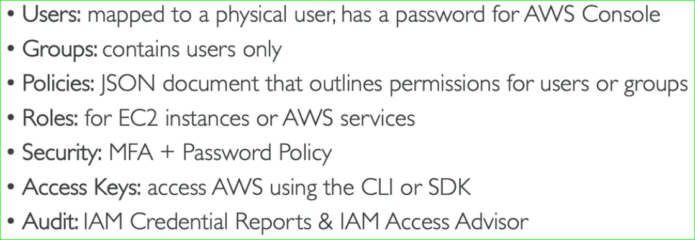

# <center>IAM Policy security guidelines

setting minimum length for password, mandatory inclusion of special and character cases as well, numbers etc.

* You can also allow new user to change password after his first login,
* Making mandatory to make users to change passwords after 30 days, preventing password-reuse
* Having MFA on all accounts. This should be mandatory for root and admin accounts
* Types of a MFA
  1. virtual device --working on a single device at a time
  2. Universal 2nd Factor Key : A physical key

```
Hands-on:IAM to set password policy
```
---
# <center>Access Keys

Accessing AWS apart from web applications

1. CLI - [Documentation](https://github.com/aws/aws-cli), majorly used in develop scripts for automation
2. SDK - enables to use AWS account & its resources programmatically. AWS supports web, mobile and IOT device integrations

Thus to access the aws cli/sdk you need to generate the access keys from the aws IAM console to get AWS account access.<br>

***Access keys are secret (accessKeyID ~ username, secretAccessKey ~ password), just like password, never share them with anyone***

***Dont use root/admin account to generate access keys***

## Hands - on

```markdown

Hands-on : Creating Access keys from IAM Console

1. IAM Console -> Users -> select a non root & admin IAM user -> security credentials -> create access keys
2. Download the csv files and keep it as secret
```

```markdown
Hands-on : Setting up AWS Account from CLI
```

In CLI,

1. aws configure, enter accesskeyId and secretAccessKey & for region of your location, 
2. now test it by running, aws iam list-users -> This command should show list of all IAM users in the console

## AWS Cloud Shell

An alternative to aws cli, where you can develop scripts right away from web console, via cloudShell service. Its like having aws cli directly on website, which doesnt need any extra access keys 

Data/Scripts that are developed from cloud shell are persistant (will not be removed upon closing of shell)

---

# <center>IAM Roles

This is like giving permissions directly to the AWS Resources/services in order to automate our tasks. <br>
Permission -> given to individual users on AWS <br>
IAM Roles -> given to individual resource on AWS

Some of the common IAM Roles

1. EC2 Instance Roles
2. Lamda function Roles
3. Cloud Formation Roles

```markdown
Hands-on : IAM Role creation for a AWS Service

IAM -> Roles -> Create Role -> AWS service -> EC2 -> IAMReadOnlyAccess -> Next -> Give a new Role name -> submit
```

---

# <center>IAM Security Tools

## IAM Credentials Report (Account Level)

lists all users and their status of various credentials

```
Hands-ON : Generating a Credentials Report
```

## IAM Access Advisor (User Level)

shows what service permissions are last accessed, and who did it. <br>
This is majorly used to reduce/remove un-necessary roles for a user.<br>

```
Hands-ON : Access Advisor in AWS & removing un-necessary roles
```

---

# <center>IAM Best practices

1. Dont use root account for other works except for aws account creation
2. 1 user = 1 pphysical user, never share your credentials.. If needed create a new user.
3. create strong password policy
4. use MFA
5. create and use Roles for permissions to AWS services
6. use access keys for  programmaitical access
7. audit permissions of your account with IAM credentials report
8. Never share IAM users & access keys

# <center>Summary

