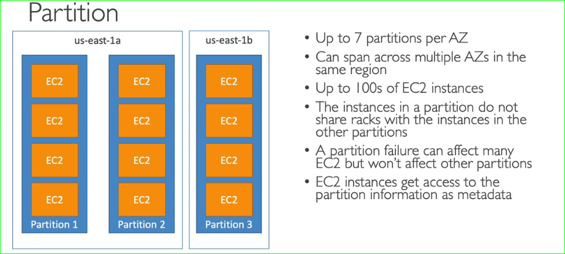

# Elastic Cloud Computing --- Infrastructure as a Service

This is fundamental since entire cloud works on this concept

To make an EC2 instance work we need

1. OS
2. No.of cores for CPU
3. Amount of RAM
4. Storage (network attached -- EBS & EFS, builtin EC2 --- Ec2 Instance Store)
5. Netword card : speed of card
6. Fire Wall Rules (Security Groups)
7. Boot strap script --- Ec2 User Data : This usually denotes a start up script that runs on every spin-up of an EC2 instance. This instance generally include software installation,updates installation, application start up, health check commands === **This is being ran as Sudo user by default**
8. Ip Address (optional)

```markdown (tutorial-32)
Hands-On : create an EC2 instance with an bootstrap that starts up an simple server
(This is also has tutorial to 
1. create SSH key pairs to access EC2 instance from a remote console
2. Define inbound and outbound rules in order to allow and see requests and response resp
3. Adding User Data in Ec2 instance with below script
    `
      #!/bin/bash
      yum update -y
      yum install -y httpd
      systemctl start httpd
      systemctl enable httpd
      echo "Hello from $(hostname -f) > /var/www/html/index.html
    `
)
```

# EC2 Instance Types

## Naming Convention of Instance Types:

m5.2xlarge ==>

* m = instance class
* 5 = generation of instance
* 2xlarge = size within in instance class (The more the size, the more will be CPU power, memory and network bandwidth)

## Types

[Know more](https://instances.vantage.sh)

1. General purpose
   1. Great for web servers and code repositories
   2. Have good balance on cpu, memory and network
2. Compute optimized
   1. Great for compute-intense tasks  that are in need of high performance processors
      1. Batch processing
      2. Media transcoding
      3. High performance webservers
      4. High Performance computing (HPC)
      5. Dedicated Gaming Servers
      6. Scientific Modelling & AI modelling
   2. They are having instance representation as `c`
3. Memory optimized
   1. This is used when we need process large amount of datasets in memory
   2. Use Cases :
      1. High Performance Relational/Non-relational Databases
      2. distributed web scale cache stores
      3. In memory databases for BI
      4. Application performing real-time processing of big unstructed data
   3. The instance class will be `R, X1, High memory, z` (R-RAM)
4. Storage optimized
   1. Great for storage-intensive tasks where we need high sequential read and write access to large data on local storages
   2. Use Cases :
      1. OLTP
      2. Relation and Non relational databases
      3. Cache for IN memory (Redis)
      4. Dataware housing applications
      5. Distributed File systems
   3. Instance class includes `i3, D2, D3, H1`
5. Accelarated computing

# Security Groups & Ports

* They are firewall around your EC2 instances, thus it will live outside of your Ec2 instance
* These will control the inflow and outflow of traffic to and fro, from your EC2 instance and internet
* Security Groups only contain `allow` rules
* They regulate
  1. Access to ports
  2. Authorize IP ranges - IPV4, IPV6
  3. control of Inbound network (from others to instance)
  4. control of outboud network (from instance to others)
* They can reference by IP or another group
* Same group can be attached to multiple instances
* locked down to AWS region/VPC  -- If you switched new region, then you need to regenerate security groups
* It is good to maintain a separate Security Group for SSH Access
* ***If your applications is not accessible with <u>timeout Issue/connection timeout</u>, then it is probably due to security group issue***
* ***If your applications is not accessible with <u>connection refused</u>, then it is probably due to application error or its not launched yet***
* All Inbound traffic is blocked by default
* All Outbounf traffic is allowed by default
* 

Remeber these port numbers

1. 22 - SSH, SFTP
2. 21 - FTP
3. 80 - HTTP
4. 443 - HTTPS
5. 3389 - RDP == Windows Remote Desktop Protocol

```
Hands-on : creating an SG and attaching to an EC2 instance
```

### EC2 Instance Connect

* AWS Instance connect comes with built in aws cli 
* ## Never run aws configure or store the aws credentials from EC2 Instance connect. If we store it, then anyone from other account will be able to conenct to your instance and know your credentials
* ## Thus in order to prevent above, we use ***IAM Roles***
* # Thus provide permissions to ec2 instances only via IAM Roles

```
Hands-On : EC2 Instance Connect
```

# IAM Roles

```
Hands - On : create a IAM Role and attach it to a EC2 instance
```

# EC2 Purchaing Options


Dedicated instances mean you run your instances in your own software, where as dedicated hosts lets access Physical server itself there by showing you underlying hardware


# EC2 Spot Instances Request

Pricing graph : https://console.aws.amazon.com/ec2sp/v1/spot/home


```
Course - 42
Hands - On : Creating spot fleet instances
Hands - On : Creating spot instances
```


---

# Exam Topics

# Public vs Private vs Elastic IP

Elastic IP - 
* whenever you restart your EC2 instance its public IP get changed everytime. 
* In order to have a fixed public IP, you need Elastic IP -- same as public IP, 
* can attached to one instance at a time.
* You can have atmost 5 Elastic IPs in your account
* Try to avoid using elastic IPs


# EC2 Placement Groups

* strategy for placements of our instances during their creation
* Strategies : 
  1. Cluster = instances are placed in low-latency group in single AZ <br> <br>
  
  2. Spread = spreads instances across underlying hardware (max 7 instances in per group per AZ) <br> <br>
  
  3. Partition = spread across diffrent partitions(different racks) within AZ. Scales to 100s of EC2 instances per group (Hadoop, Kasandra, Kafka -- thus mostly used for big data applications) <br> <br>
  

```
Hands-on:placement groups
```

# EC2 Hibernate

During EC2 instance startup, it picks up the userdata, executes thus connection to db, storage, network and caches etc. This can take some time to get ready for work.
During termination of an instance, It closes above connections, cleans up the storage, dn, network attached to it in order to remove an instance.

But Hibernate allows to Instance to preserve last working state of EC2 instance, and then keeping ec2 instance in stop mode.

* In memory data of instance is preserved by storing the data in EBS volumes
* this makes OS to boot faster on next reload
* Hence we need to have EBS volume that is encrypted and size should be equal to ram size


Use cases

* Long running processes
* saving ram state

```
Hands - On :EC2 Hibernate
```

# AMI -- Amazon Machine Image

1. EC2 instance with a defined software, hardware, network and monitoring configuration
2. customized instances of EC2
3. you can create your own image, here you will have `faster bootloads` because of pre-packaging the image
4. AMI can built for specific AZ -- can be moved across regions as well.
5. You can luanch EC2 instances from
   1. ### Public AMI -- provided by amazon
   2. ### Your own AMI -- make & maintain them.
   3. ### AWS Marketplace -- created by maintained by other vendors
6. ## creation of our own AMI Process
   1. launch an EC2 instance and customize it
   2. stop it
   3. build an AMI -- this creates EBS snaphosts behind the scenes
   4. now you want to create an new instance, choose your own image from the AMI options shown during ec2 instance creation

```
Pending Hands - On :AMI Creation
Pending Hands - On :Launching a new instance from our own AMI image
```
