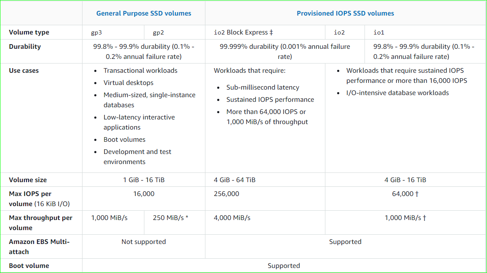

# EBS (Elastic Block Storage) Volume

* These are the drives that are connected to EC2 instances on the fly with the help of network drives, Hence these are not physical drives.
* Since we are using network here, there is expected some latency here
* ## This persists data even after instance termination. This is done by `Delete on Termination` option attribute while creation an ec2 instance (This might come in exam)
* By Default,
  * For Root instance, above option is disabled -- Volume will be deleted after termination of ec2 instance
  * Any manually created instance, above option is enabled
* We can attach multiple EBS volume to an ec2 instance, hence we attach and detach an EBS volume to an ec2 instance at any time.
* Bound to AZ. Hence in order to use them across AZ, you need to create a snaphot of a volume -> migrate to that AZ -> then attach the snapshot over that instance in new AZ
* Hence Keep in mind that <u>**Whenever you create a EBS Volume, it should match the location/AZ of your EC2 instnace**
* Analogy - **Netword USB Drive**</u>
* Here capacity for EBS is measured in `IOPS`,`GBs`

```
Hands - ON : EBS Volumes creation & attaching to an EC2 instance
```

# EBS Volume Types 

These are characterized in size | throughput | IOPS

1. ### gp2, gp3 (SSD): General purpose - SSD volumes that balances price and performance for a wide variety of workloads (can be used as boot volumes)
2. ### io1, io2 (SSD): Highest performance- SSD Volumes that required for mission-critical, low-latency, high through put workloads (can be used as boot volumes)
3. ### st1 (Throughput Optimized HDD): low cost HDD volumes for frequent access, throughput intensive works
4. ### sc1 (Cold HDD): lowest cost HDD volumes for less frequent access

> GP and Io are important for exam

## General Purpose Instances

1. cost effective, low latency
2. used for system boots, development & test envs, virtual desktops
3. 1gb-16tb
4. gp3 (latest version)

## Provisional IOPS -- Highest Perfomance (PIOPS) SSD

1. critical business applications which needs more than 16,000 IOPS. (great for db workloads that are sensitive to storage perf and consistency)
2. 4gb-16tb
3. can increase the IOPs accordingly
4. io1/io2 -- more durability and more IOPS per GB
5. io2 Block Express -- sub secnod latency

### EBS Multi Attach to Ec2 -- io1/io2 family

* Attaching `same  EBS` volume to `different EC2 instances` present in `same AZ`. 
* Each EC2 instance will have full r/w access.
* At max, we can attach 16 instances at a time.
* must file system that is cluster aware
* Mainly used for
  1. Higher application availiability (Teradata)
  2. application that needs concurrent write operations

## Hard Disk Drive Volumes (sc1, st1)

1. size 125 gb - 16 tb
2. st1
   1. great for **Big Data**, **Data warehouses**, **Log processing**
   2. max through put - 500 mbps , max IOPs - 500
3. sc1
   1. max throughput - 250 mbps



# Snapshots + migration

there will be a time where you're gonna need to replicate ec2 instances along with data. 
thus for ebs you need to create a snapshot and then you have to migrate it to new location.
it is noy needed to detach volumes in orderto take a snapshot.

## Features of EBS Snapshots

1. ### EBS snapshot archive 
   1. 75% cheaper than the normal reta
   2. takes 24-72 hrs to restore the EBS volume from this archive
2. ### Recycle Bin EBS 
   1. setup rules to retain deleted snapshots so you can restore them after accidental deletion (specifying retention to delete from 1 day to 1 year)
3. ### Fast Snapshot restore
   1. force full initiation of snapshot to have no latency on first use.
   2. costs lot of money
   3. this is used esp for very large EBS snapshots

```
Pending Hands - ON : EBS Volumes creation & attaching to an EC2 instance
```

# EBS Encryption

When you enable encryption for EBS volume

1. all internal data of volume will be encrypted
2. all data in flight between instances and volumes is encrypted
3. all snapshots are encrypted
4. all volumes created from above snapshot are encrypted

The encryption and decryption is handled by AWS. Has minimal impact.

```
Pending Hands - On : Encrypting an EBS volume
```


# EC2 Instance Store

1. EBS volumes are network drives with good but `limited performance`
2. for high performance hardware disk, use EC2 Instance Store.
3. These will be attached to your EC2 instance. Basically, EC2 instances are your virtual machines.. some of them can contain network & harddisk attached to them directly.
4. Thus above type of EC2 instance can called as EC2 Instance store
5. use them better IO performance, caching, buffer, temporary content -- but not for long term storage.
6. They loose the data if they are stopped/ whenever you terminate the EC2 instance -- there is a risk of data loss
7. its your responsibility `to maintain backups and replication of these instances`

```
Pending Hands - On: cleaning up EFS & EBS
```